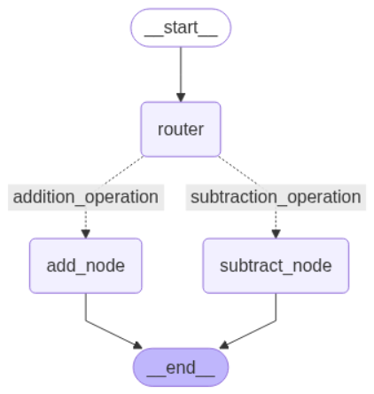
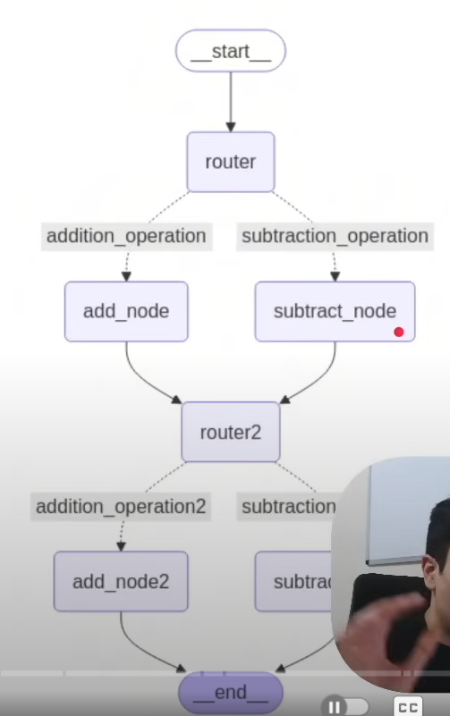

# [1] Hello World Graph 🌍

**Objectives:**

1. Understand and define the AgentState structure

2. Create simple node functions to process and update state

3. Set up a basic LangGraph structure

4. Compile and invoke a LangGraph graph

5. Understand how data flows through a single-node in LangGraph

# [2] Multiple Inputs Graph

**Objectives:**

1. Define a more complex AgentState.

2. Create a processing node that performs operations on list data.

3. Set up a LangGraph that processes and outputs computed results.

4. Invoke the graph with structured inputs and retrieve outputs.

5. Main Goal: Learn how to handle multiple inputs

# [3] Conditional Graph

**Objectives:**

1. Implement *conditional* logic to route the flow of data to different nodes  
2. Use **START** and **END** nodes to manage entry and exit points explicitly  
3. Design multiple

# [4] Exercise for Graph

**Your task:**

Make the graph on the right! You will need to [make use of 2 conditional edges](#).

**Input:**  
`initial_state = AgentState(number1 = 10, operation="-", number2 = 5, number3 = 7, number4 = 2, operation2 = "+", finalNumber = 0, finalNumber2 = 0)`

